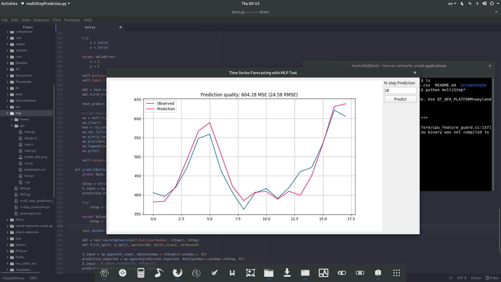

#neural-networks-small-applications

-> adjustLayer.py

It will test some numbers of hidden layes and finds the best one.
 
 

-> multiStepPrediction.py

It will produce predictions for n-step forward.
 
 
